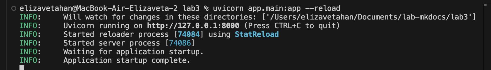
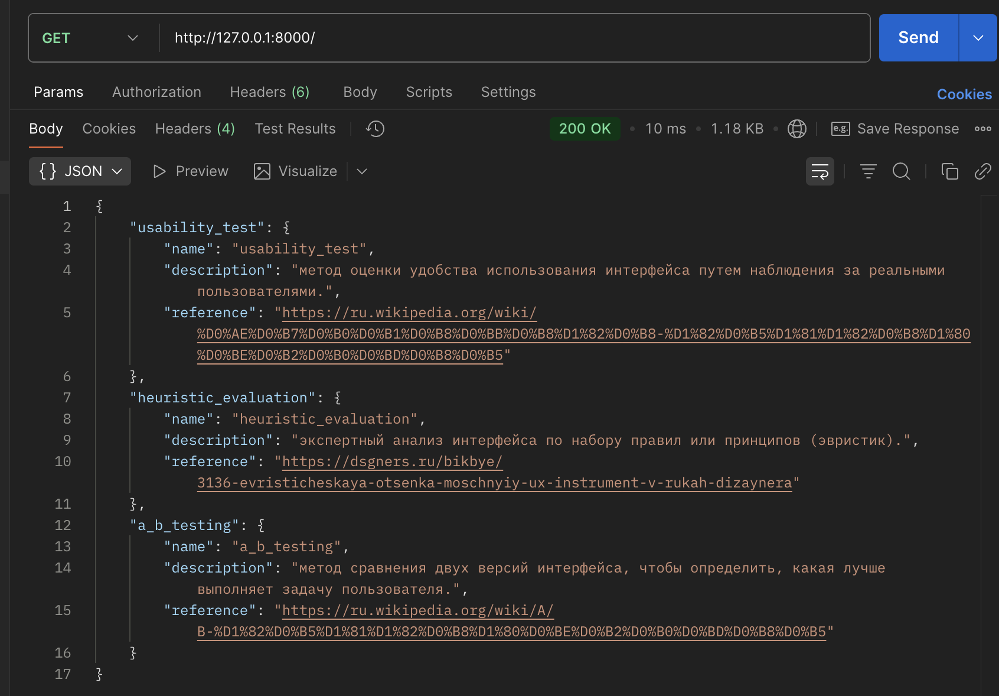
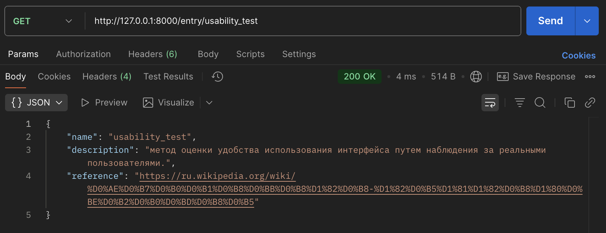
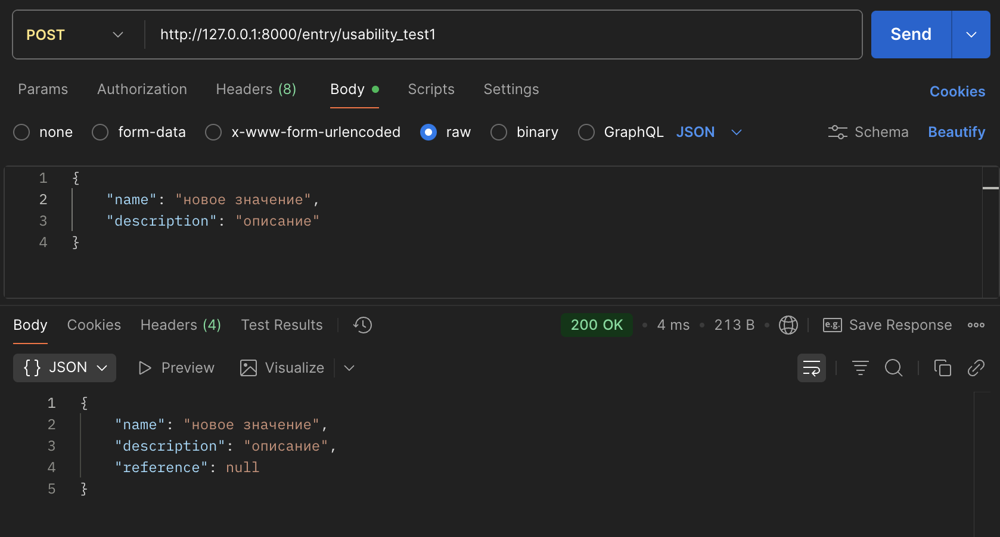
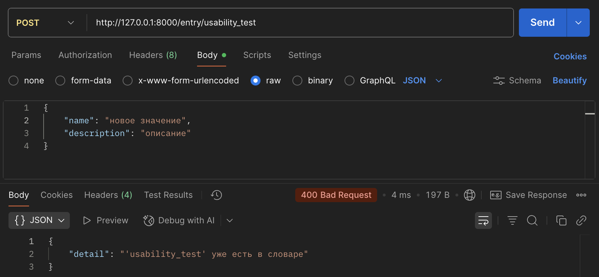
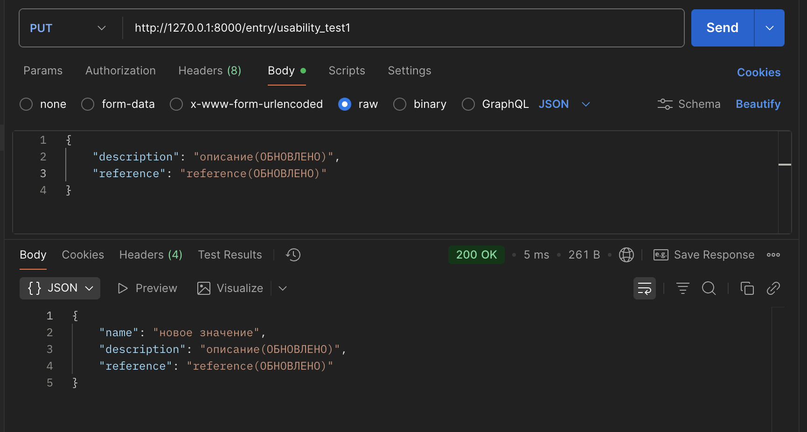
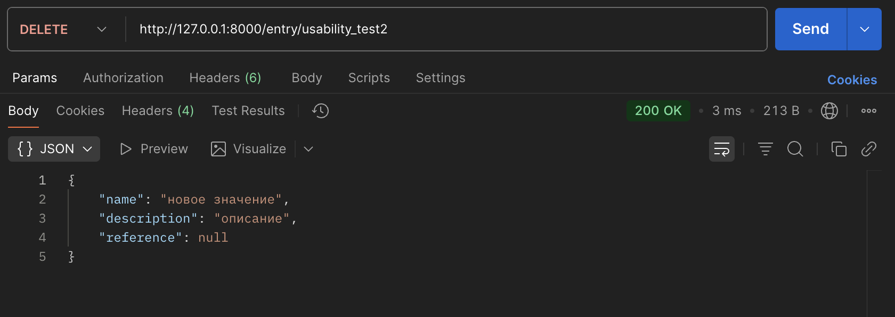
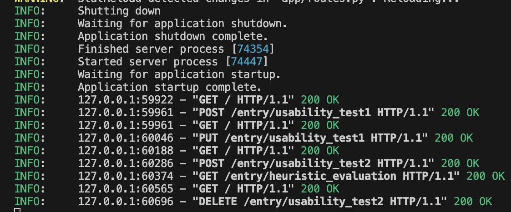

# lab3-restAPI

1. Заполнение БД, написание логики приложения и отрабатывания операций длы получения всех и одного элемента списка, а также добавления, удаления и редактирования.

2. Запуск rest API приложения

3. Получение списка всех терминов

4. Получение термина по ключу

5. Добавление нового термина

6. Ошибка добавления нового термина (термин уже существует)

7. Обновление существующего термина

8. Удаление термина

9. Логи сервера

